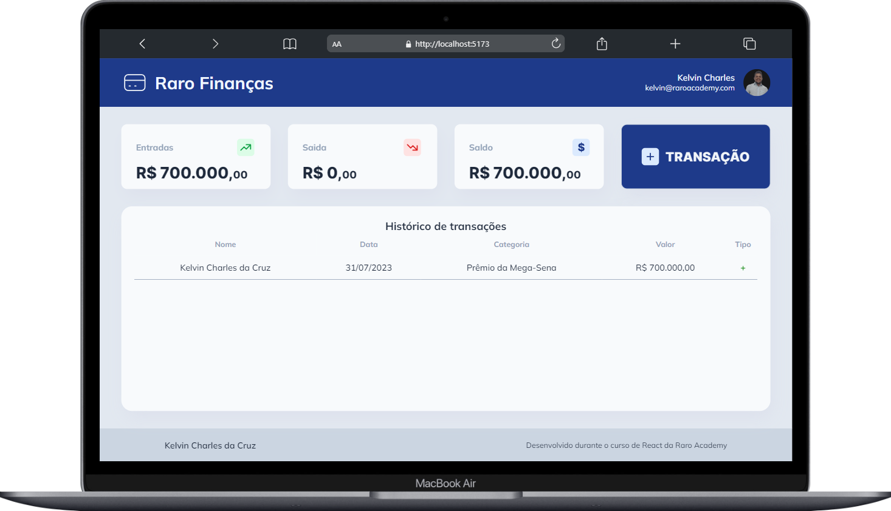
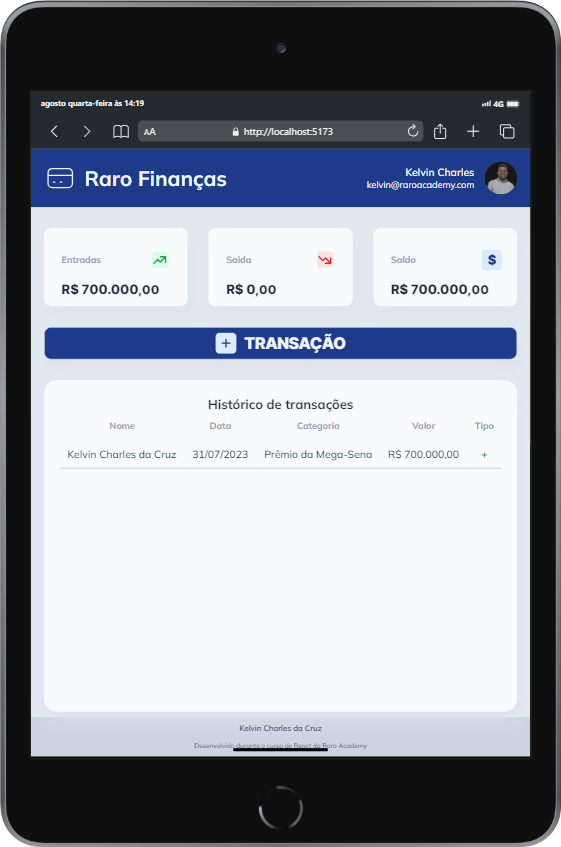

  
  <h1>Exercício Avaliativo Raro Finanças</h1>

## 💡 **Proposta**

Exercício avaliativo da Raro Academy.  
Desenvolver uma Landing Page de finanças em React usando useStates para fazer suas funcionalidades!

## ✍️ **Processo**

    . Marcação semântica HTML5
    . Propriedades personalizadas de CSS3
    . Flexbox
    . TypeScript
    . React
    . Design responsivo

## ⚙ **Funcionalidades**

    - Realizar abertura de Modal quando clicar no botão transação
    - No modal aparece na tela um formulário com informaçoes de transação
    - No formulário temos dois botões, um cancelar que fecha o Modal outro Adicionar para adicionar a nova transação
    - Quando adiocionar nova transação aparecer a propria transação na lista de transações
    - Mostrar da aba de Dash o resultado das transaçoes sendo eles valores de entrada, saida, saldo
    - Alterar saldo de acordo com casa transação seja ela de entrada ou saida  

## 💪 **Desafios**

      - Trabalhar com React foi muito legal e ao mesmo tempo desafiador
      - Esse foi meu primeiro contato com o React e tive bastante dificuldade em Saber o que componentizar, acabei fazendo mais componentes que precisava. 
      - Como criei mais componentes que precisava tambem tive muita dificuldade em passar coisas de um componente pro outro
      - Lidar com estados pela primeira vez tambem foi um desafio grande.
      - Minha maior dificulda foi em iniciar os processos, pois criei muitos componentes e nao sabia por qual iniciar.

#### Tela principal de cadastro desktop

  
  
  

#### Tela de login e cadastro tablet e mobile

  

## 👩‍💻 **Dev**

<table align="center">
    <tr>  
        <td align="center">
            

                 
                    <b> Kelvin Charles </b> 
                        
                        
            

        </td>
    </tr>
</table>
